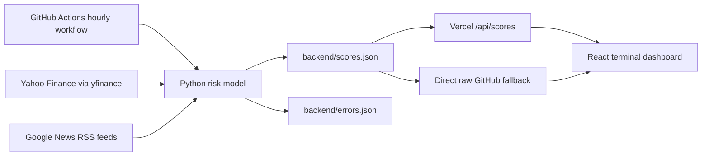

# WarStock

WarStock is an experimental risk-signal dashboard that combines defense equity
movement with conflict-related news volume. A Python model runs on a scheduled
GitHub Actions workflow, writes a timestamped score history, and a React
terminal-style frontend visualizes the latest signal, trend line, and exportable
history.

> WarStock is a portfolio project and research experiment. It is not financial,
> geopolitical, safety, or investment advice.

## Highlights

- Hourly backend scoring job powered by GitHub Actions
- Defense-stock signal from `LMT`, `NOC`, `RTX`, `GD`, and `BA`
- News signal from 3 Google News RSS searches
- Keyword-weighted conflict scoring with 44 tracked terms
- React, Tailwind CSS, and Recharts frontend
- Vercel serverless API for fetching private GitHub-hosted score history
- JSON and CSV exports from the browser
- Direct GitHub fallback if the Vercel API route fails

## Demo

Add a screenshot or short GIF here once the app is deployed:

```md

```

Recommended portfolio shots:

- Full dashboard with the latest score visible
- Score chart filtered to week or month
- Data table with recent hourly runs
- GitHub Actions run showing the automated model update

## Architecture



## How It Works

The backend creates one score entry per model run:

```json
{
  "timestamp": "2026-05-29T00:00:00Z",
  "stock_score": 0.123,
  "news_score": 0.456,
  "raw_score": 18.96
}
```

### Stock Signal

The stock signal tracks daily percentage movement across five defense-related
tickers:

- `LMT`
- `NOC`
- `RTX`
- `GD`
- `BA`

Each ticker's 2-day close movement is normalized against a 5% move, clamped from
0 to 1, and averaged across available tickers.

### News Signal

The news signal fetches all currently returned entries from three Google News
RSS searches:

- `military conflict`
- `defense systems`
- `drone strike`

Each headline and summary is scanned for conflict-related keywords. Base
keywords count as 1 hit, high-severity keywords count as 2 hits, and the average
hit rate is normalized into a 0 to 1 score.

### Final Score

The raw risk score is a weighted blend:

```text
raw_score = min((0.8 * stock_score + 0.2 * news_score) * 100, 100)
```

If a live data source fails, the model records the error and falls back to the
previous valid score for that signal.

## Tech Stack

- **Frontend:** React, Vite, Tailwind CSS, Recharts
- **Backend:** Python, yfinance, feedparser, requests
- **Automation:** GitHub Actions scheduled workflow
- **Hosting:** Vercel frontend and serverless API routes
- **Data format:** JSON score history committed by automation

## Project Structure

```text
.
|-- backend/
|   |-- main.py          # scoring orchestration and score history writes
|   |-- news_data.py     # RSS fetching and keyword scoring
|   |-- stock_data.py    # defense-stock signal calculation
|   |-- scores.json      # generated score history
|   `-- errors.json      # generated backend error log
|-- frontend/
|   |-- api/
|   |   |-- scores.js       # Vercel API route for score history
|   |   `-- check-token.js  # deployment token diagnostic
|   `-- src/
|       |-- App.jsx         # dashboard, chart, table, exports
|       `-- BootScreen.jsx  # terminal boot animation
`-- .github/workflows/
    `-- run-hourly.yml      # scheduled model run
```

## Running Locally

### Backend

```bash
pip install -r requirements.txt
cd backend
python main.py
```

The backend requires network access for Yahoo Finance and Google News RSS. It
does not require a news API key.

### Frontend

```bash
cd frontend
npm install
npm run dev
```

The frontend loads scores from `/api/scores` in production and falls back to the
raw GitHub `backend/scores.json` file if the API route fails.

## Deployment Notes

Set `GITHUB_TOKEN` in the Vercel project environment so `/api/scores` can fetch
the private GitHub-hosted score history.

To verify that Vercel can read the environment variable, visit:

```text
/api/check-token
```

Expected response:

```json
{ "tokenPresent": true }
```

The backend model is scheduled in `.github/workflows/run-hourly.yml`:

```text
0 * * * *
```

That means the backend runs hourly in UTC. The frontend also fetches on page load
and can refresh on demand from the UI.

## Portfolio Talking Points

- Built a full data loop: scheduled ingestion, model scoring, persisted history,
  API delivery, frontend visualization, and exports.
- Designed graceful degradation for flaky external data sources by logging
  errors and falling back to previous valid scores.
- Kept the model intentionally transparent: every score is decomposed into stock
  and news components rather than hidden behind an opaque prediction.
- Used serverless deployment patterns to keep the frontend simple while avoiding
  exposing private GitHub credentials in the browser.

## Next Improvements

- Add unit tests for scoring, fallback behavior, and payload normalization
- Add a `/api/status` route with latest run time, error count, and freshness
- Show top matched headlines and keyword hits in the dashboard
- Add PR CI for Python tests and `npm run build`
- Move generated score history to a small database once history grows large
